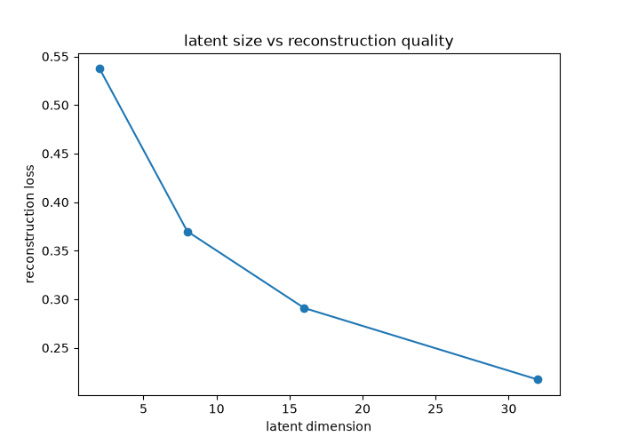
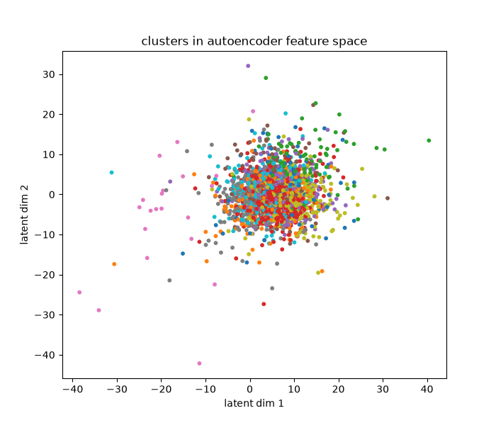
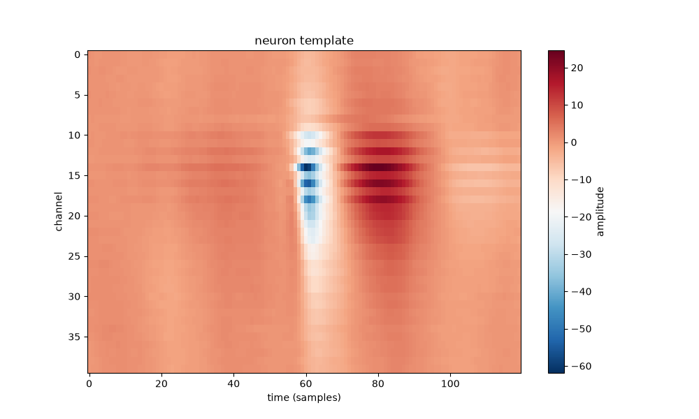
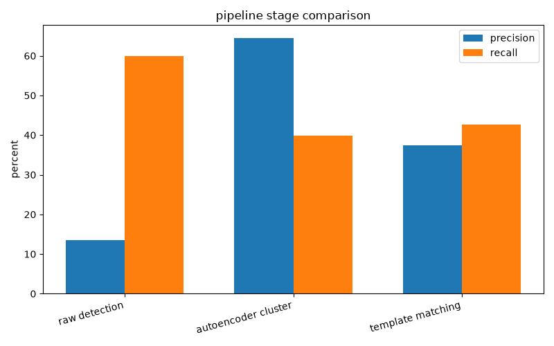

# pulse-sort

A closed loop spike sorting pipeline built on in-vivo Neuropixel recordings which includes multi-channel detection, an autoencoder, and iterations to make the pipeline close-looped. I built this project to extend my original project with a basic single-channel pipeline: [fund-spike-sort](https://github.com/rrajmanna/fund-spike-sort).

## Data

In this project I used real in-vivo data from the [Kampff Lab ground-truth dataset](https://github.com/kampff-lab/sc.io) (cell `c37`). This data came from a 384-channel Neuropixel recording, giving 601 ground-truth spikes from a sample cortical neuron.

## Pipeline

1. **Multi-channel detection**: spikes were detected using a combined signal across 40 channels
2. **Waveform extraction**: each detected spike is captured as a (time × channel) snippet
3. **Autoencoder feature learning**: a small autoencoder compressed each waveform snippet into a learned feature vector
4. **Clustering**: spikes are grouped in the learned feature space (k-means clustering)
5. **Template construction**: the cluster best matching the ground-truth neuron is averaged into a template.
6. **Template matching**: the template is correlated against the full recording to find more matching spikes.
7. **Iterative refinement**: the template is repeatedly rebuilt from its own matches, and fed back into the next round of matching.

## Installation

```bash
git clone git@github.com:rrajmanna/pulse-sort.git
cd pulse-sort
python3 -m venv venv
source venv/bin/activate
pip install -r requirements.txt
```

## Usage

Each stage of the pipeline is in `src/` as a function, which I ran step by step in the notebooks under `notebooks/`.

### Detection (`src/detection.py`)
- `bandpass_filter`: isolates the frequency range where spikes are (300-6000 Hz)
- `combined_signal`: merges multiple channels into one detection signal
- `detect_spikes`: locates spike times using thresholds

### Waveform extraction (`src/waveforms.py`)
- `extract_waveforms`: builds multi-channel (time × channel) snippet around each detected spike

### Feature learning (`src/autoencoder.py`)
- `WaveformAutoencoder`: an autoencoder that compresses waveform snippets into a learned feature vector
- `train_autoencoder`: trains the autoencoder on extracted waveforms

I chose a latent dimension of 8 after checking 2-32 dimensions and comparing reconstruction loss:



### Clustering and templates (`src/templates.py`)
- `build_template`: averages a cluster's waveforms into a template for one neuron
- `template_match`: correlates a template against the recording to find matching spikes

### Iterative refinement (`src/refine.py`)
- `iterative_refine`: iteratively rebuilds the template from its own best matches

I tested many  refinement methods like naive rebuild, top-K selection, fixed candidate pool, and the final anchored approach which I kept in the code. All of them converged, but none of them improved on single-pass template matching for this dataset (limitation).

## Results

Autoencoder features outperformed PCA at the same dimensions:

| Method | Best cluster purity |
|---|---|
| PCA (8 components) | 53.9% |
| Autoencoder (8 latent dims) | **64.5%** |



Spatial template for the neuron:



Precision/recall by pipeline stage:

| Method | Precision | Recall |
|---|---|---|
| Raw multi-channel detection | 13.5% | 59.9% |
| Autoencoder + clustering | 64.5% | 39.9% |
| Template matching (0.6) | 37.4% | 42.6% |



## Acknowledgments

Ground-truth data from the [Kampff Lab](http://www.kampff-lab.org/) paired recordings dataset. Built with PyTorch, scikit-learn, NumPy, and SciPy.

doc update
